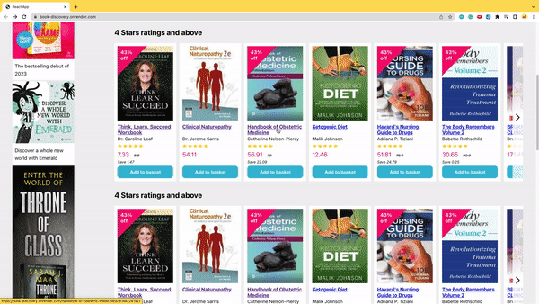

# Book Discovery [ongoing development]
A cloned web app of [Book Depository](https://www.bookdepository.com/).

My cloned app is now deployed live: https://book-discovery.onrender.com/ . There are still a lot of touching up to do and making my components clickable. But I was too excited to wait for everything to be done up before deploying it. 

Here are a list of what my deployed web can do:
1. Search for books in query bar

2. Create a dynamic route for each book displayed on the Home page

3. Display dropdown menu

The objective of the project is to use to ReactJS and MongoDB database to develop the website. Also, to include unit tests to verify the behaviour of each part of the software, robustness and security of the website.

## How to run the project
### Steps to run the project locally (i.e. on your laptop)
1. Clone github repository
2. In the root folder of the repository, run `npm install`
3. On the same terminal, run `npm start` on your terminal
4. Open another new terminal, run `npm run server`

## Misc
### Steps to import CSV file to MongoDB
- Install libraries and dependencies
- Run the following code:
`mongoimport --uri 'mongodb+srv://<user>:<admin>@cluster3.mongodb.net/?retryWrites=true&w=majority' --db kaggle-bookcovers-dataset --collection bookcovers --type=csv --headerline --file=<path-of-csv-file>`

### Web scrap
### Setup
- Create a virtual environment and activate it
- Install: `pip install beautifulsoup4`
- `pip install requests`

## Tutorial links that helped in building this project
- [Install MongoDB Database Tool](https://www.mongodb.com/docs/database-tools/installation/installation-macos/) (required to use `mongoimport` to import JSON dataset to MongoDB)

## Acknowledgement
- Dataset from [Kaggle by Luka Anicin](https://www.kaggle.com/datasets/lukaanicin/book-covers-dataset)